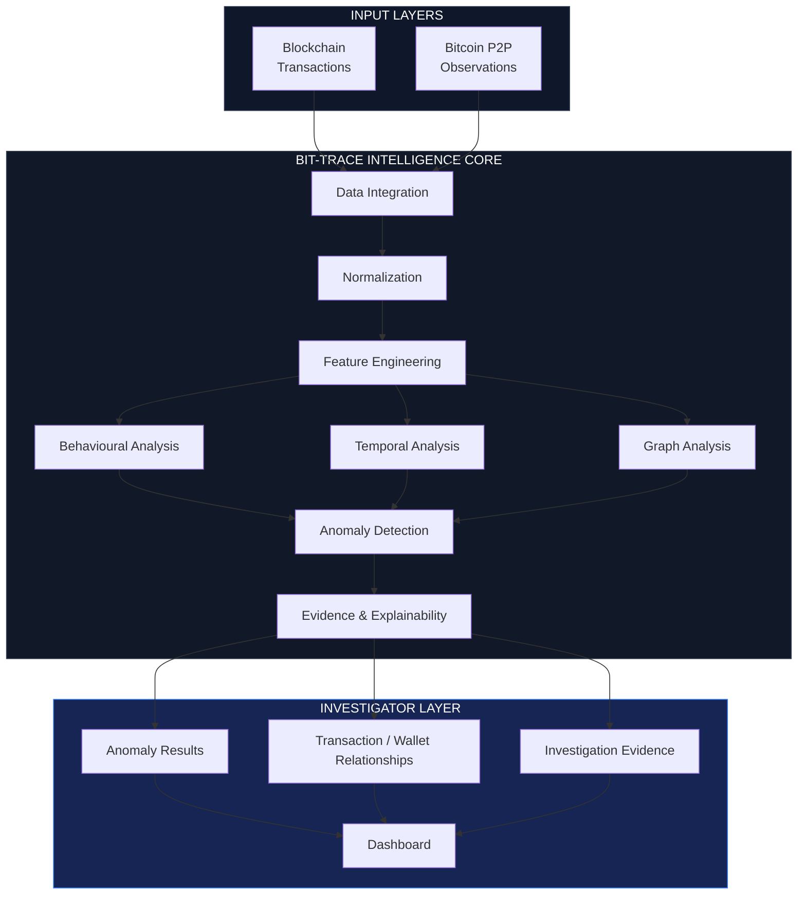
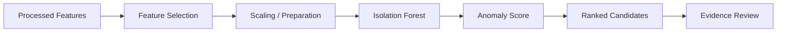
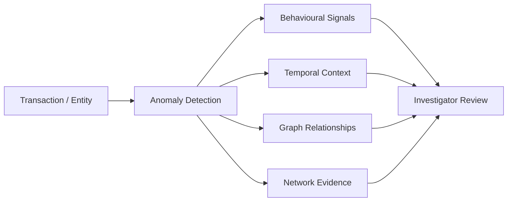

<div align="center">

# ₿ BIT-TRACE

### Offline Bitcoin Transaction Investigation & Anomaly Analysis

**Turning fragmented transaction and network data into structured investigative evidence.**

<br/>

[](https://www.python.org/)
[](https://scikit-learn.org/)
[](https://fastapi.tiangolo.com/)
[](https://react.dev/)
[](https://www.postgresql.org/)
[]()

<br/><br/>

<a href="#-overview">Overview</a> • <a href="#-architecture">Architecture</a> • <a href="#-data-pipeline">Pipeline</a> • <a href="#-machine-learning">ML</a> • <a href="#-evidence">Evidence</a> • <a href="#-setup">Setup</a>

</div>

---

## ⚡ What is BIT-TRACE?

BIT-TRACE is an **offline-first platform for investigating unusual Bitcoin transaction behaviour**.

The project combines blockchain transaction records with Bitcoin P2P network observations and derived behavioural features. Instead of looking at a transaction in isolation, the system examines **patterns, relationships, timing and statistical deviations** to surface activity that may deserve closer investigation.

The current ML pipeline uses **unsupervised anomaly detection**, with Isolation Forest as the baseline model.

> **Important:** BIT-TRACE identifies *anomalies*, not criminal activity.
> An anomaly is an investigative lead that requires human review and additional evidence.

---

## 🧭 Navigate

<table>
<tr>
<td align="center" width="25%">

### 🔬 Research

Dataset analysis, feature engineering and correlation studies.

</td>
<td align="center" width="25%">

### 🤖 AI / ML

Unsupervised anomaly detection and behavioural analysis.

</td>
<td align="center" width="25%">

### 🕸️ Graph

Wallet and transaction relationship analysis.

</td>
<td align="center" width="25%">

### 🖥️ Investigation

Evidence-oriented results and investigator views.

</td>
</tr>
</table>

---

# 🧩 Why BIT-TRACE?

Bitcoin transactions are public, but investigating large transaction datasets is not straightforward.

A single transaction tells only part of the story.

An investigator may need to examine:

```text
Transaction
     │
     ├── Amount / Value
     ├── Inputs & Outputs
     ├── Timestamp
     ├── Previous / Next Relationships
     ├── Wallet Behaviour
     ├── Network Observations
     └── Historical Activity
```

The problem becomes harder when the information comes from **different datasets with different schemas and granularities**.

BIT-TRACE was built around this workflow:

```text
      Fragmented Data
             │
             ▼
   ┌─────────────────────┐
   │ Integration &       │
   │ Normalization       │
   └──────────┬──────────┘
              │
              ▼
   ┌─────────────────────┐
   │ Feature Engineering │
   └──────────┬──────────┘
              │
       ┌──────┼───────┐
       ▼      ▼       ▼
   Behaviour Time   Graph
   Analysis Analysis Analysis
       │      │       │
       └──────┼───────┘
              ▼
      Anomaly Detection
              │
              ▼
       Evidence Layer
              │
              ▼
      Investigator View
```

---

# 🏗️ Architecture



---

# 🔬 Data Pipeline

The data workflow is deliberately separated into stages so that every transformation can be inspected independently.

### 01 · Raw Data

The project works with Bitcoin-related datasets including:

* Blockchain transaction data
* Bitcoin P2P network observations
* Elliptic++ transaction/features data
* Derived project-level correlated views

### 02 · Data Inspection

Before modelling, the datasets are inspected for:

* Schema differences
* Missing values
* Data types
* Duplicate records
* Identifier consistency
* Feature distributions
* High-cardinality fields

### 03 · Normalization

Different sources are transformed into a consistent analytical representation.

### 04 · Feature Engineering

Features are grouped according to their role:

```text
┌─────────────────────────────────────────────┐
│              FEATURE GROUPS                  │
├─────────────────────────────────────────────┤
│ Local Behaviour                             │
│ Transaction Characteristics                 │
│ Aggregate Behaviour                         │
│ Temporal Signals                            │
│ Network Observations                        │
└─────────────────────────────────────────────┘
```

### 05 · Correlation Analysis

Highly correlated features are examined before modelling to understand redundancy and relationships within the feature space.

For the current analysis, correlated relationships were grouped into categories such as:

```text
Local ↔ Local
Local ↔ Transaction
Transaction ↔ Transaction
Aggregate ↔ Aggregate
```

This step helps prevent blindly feeding a large collection of redundant variables into the downstream pipeline.

---

# 🧠 Machine Learning

## Unsupervised Anomaly Detection

The initial BIT-TRACE model uses **Isolation Forest**.

Why?

Because a large part of the available transaction data does not come with reliable labels saying:

```text
"Suspicious"
"Legitimate"
```

for every observation.

Instead, the model learns the structure of the available data and identifies observations that appear unusual relative to that structure.



### Current model concept

```python
IsolationForest(
    contamination="auto",
    random_state=42
)
```

The exact configuration is kept in the project code so experiments remain reproducible.

---

# 🕸️ Transaction & Wallet Graph

Bitcoin transactions naturally form a network.

A simplified representation looks like:

```text
          Wallet A
          /      \
         /        \
      TX-01      TX-02
        │          │
        ▼          ▼
    Wallet B    Wallet C
        \          /
         \        /
          TX-03
             │
             ▼
          Wallet D
```

Graph analysis allows BIT-TRACE to move beyond flat transaction tables and inspect relationships such as:

* Wallet connectivity
* Transaction paths
* Connected components
* Highly active entities
* Repeated interaction patterns
* Potentially unusual clusters

---

# 📊 Investigation Workflow

A flagged transaction is not treated as a final answer.

The intended workflow is:



This makes the distinction between **machine-generated signals** and **human investigation** explicit.

---

# 📸 Project Preview

> Screenshots below should be replaced with the actual outputs from the repository.

### Architecture

<p align="center">
  
</p>

### Dataset Analysis

<p align="center">
  
</p>

### Anomaly Detection

<p align="center">
  
</p>

### Investigator Dashboard

<p align="center">
  
</p>

---

# 📑 Evidence & Proof

The repository keeps the analytical work separate from the final application so that the development process can be inspected.

<details>
<summary><strong>📊 Dataset Analysis</strong></summary>

Includes:

* Dataset structure
* Column analysis
* Missing-value analysis
* Data distributions
* Feature statistics
* Schema comparisons

</details>

<details>
<summary><strong>🧮 Feature Engineering</strong></summary>

Includes:

* Feature grouping
* Derived features
* Feature relationships
* Correlation analysis
* Redundancy investigation

</details>

<details>
<summary><strong>🤖 Machine Learning</strong></summary>

Includes:

* Model preparation
* Isolation Forest experiments
* Anomaly scores
* Candidate ranking
* Model outputs

</details>

<details>
<summary><strong>🕸️ Graph Analysis</strong></summary>

Includes:

* Wallet relationships
* Transaction connectivity
* Graph construction
* Cluster exploration

</details>

<details>
<summary><strong>📄 SIH Documentation</strong></summary>

Project documentation and proof material prepared for **Smart India Hackathon 2026**.

</details>

---

# 📂 Repository Structure

```text
BIT-TRACE/
│
├── backend/
│   ├── api/
│   ├── services/
│   └── ...
│
├── frontend/
│   ├── src/
│   └── ...
│
├── data/
│   ├── raw/
│   ├── processed/
│   └── sample/
│
├── notebooks/
│   ├── exploration/
│   ├── feature-analysis/
│   └── anomaly-detection/
│
├── src/
│   ├── preprocessing/
│   ├── features/
│   ├── models/
│   ├── graph/
│   └── explainability/
│
├── results/
│   ├── figures/
│   ├── anomaly-results/
│   └── reports/
│
├── docs/
│   ├── architecture/
│   ├── proof/
│   └── screenshots/
│
├── requirements.txt
├── README.md
└── LICENSE
```

---

# 🚀 Setup

## Requirements

* Python 3.x
* Node.js
* npm
* PostgreSQL
* Git

Optional components used by specific services:

* Redis
* RQ

---

## Clone

```bash
git clone https://github.com/<USERNAME>/bit-trace.git
cd bit-trace
```

## Python environment

### Windows

```powershell
python -m venv .venv
.venv\Scripts\activate
```

Then:

```powershell
pip install -r requirements.txt
```

---

## Dataset

Large datasets are **not stored directly inside this repository**.

Create the required directory:

```text
data/
└── raw/
    └── elliptic-plus-plus/
```

Then place the downloaded datasets according to the instructions in:

```text
docs/DATASET.md
```

> Keeping large raw datasets outside Git makes the repository easier to clone and maintain.

---

# ▶️ Running the Project

### Data processing

```bash
python <preprocessing-script>
```

### Feature analysis

```bash
python <feature-analysis-script>
```

### Anomaly detection

```bash
python <anomaly-detection-script>
```

### Backend

```bash
cd backend
uvicorn main:app --reload
```

### Frontend

```bash
cd frontend
npm install
npm run dev
```

> Replace the placeholder commands above with the final scripts/entry points once the repository structure is finalized.

---

# 🧪 Reproducibility

The project is organized so that the major analytical stages can be reproduced independently.

```text
Raw Data
   ↓
Preprocessing
   ↓
Feature Engineering
   ↓
Correlation Analysis
   ↓
Model Input
   ↓
Anomaly Detection
   ↓
Results
```

Experiments should record:

* Dataset version
* Feature set
* Model parameters
* Random seed
* Output location

This makes it easier to compare different experiments without losing track of what changed.

---

# ⚠️ Important Note

BIT-TRACE is an **investigation-support system**, not an automated accusation engine.

An anomaly may occur because of:

* unusual but legitimate activity
* rare transaction behaviour
* data quality issues
* unusual network conditions
* limitations of the anomaly model

Therefore:

```text
Anomaly ≠ Illicit Activity
```

The system is intended to help an investigator decide **where to look next**, not make the final decision for them.

---

# 🛣️ Roadmap

### Data

* [x] Dataset exploration
* [x] Schema analysis
* [x] Feature inspection
* [x] Correlation analysis
* [ ] Automated data validation

### ML

* [x] Isolation Forest baseline
* [x] Anomaly scoring
* [ ] Additional anomaly-detection models
* [ ] Model comparison
* [ ] Advanced explainability

### Graph

* [x] Transaction relationship analysis
* [ ] Interactive graph exploration
* [ ] Cluster-based investigation
* [ ] Advanced graph features

### Application

* [ ] Investigator dashboard
* [ ] Case management
* [ ] Evidence timeline
* [ ] Exportable investigation reports

---

# 🔒 Design Principles

BIT-TRACE follows a few simple principles:

**Offline first**
Core analysis should not depend on a live blockchain connection.

**Evidence over labels**
The system surfaces signals and supporting context rather than making unsupported claims.

**Reproducible analysis**
Data transformations and experiments should be traceable.

**Human in the loop**
Machine learning assists investigation; it does not replace investigator judgement.

**Large-data aware**
The system is designed around the practical constraints of large transaction datasets.

---

# 👥 Team

## TechNova014

### BIT-TRACE · Smart India Hackathon 2026

A student-built research and engineering project focused on applying machine learning and graph-based analysis to Bitcoin transaction investigation.

---

# 📚 References

The project builds on work related to:

* Bitcoin transaction analysis
* Bitcoin P2P network analysis
* Elliptic / Elliptic++ datasets
* Graph-based analysis
* Unsupervised anomaly detection
* Isolation Forest
* Explainable machine learning

Dataset-specific citations and research references are maintained separately in the project documentation.

---

<div align="center">

## ₿ BIT-TRACE

**Investigate patterns. Follow relationships. Examine the evidence.**

<br/>

`Bitcoin Data` → `Behaviour` → `Graph` → `Anomaly` → `Evidence`

<br/>

⭐ If you find the project interesting, consider starring the repository.

</div>
